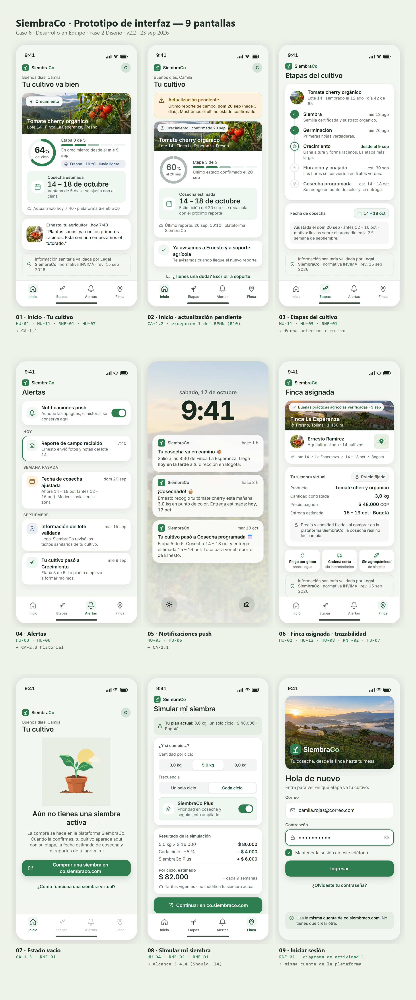

# Mockups — prototipo de interfaz

Pantallas de alta fidelidad de la app, con la identidad de SiembraCo y datos de ejemplo del caso. Cada pantalla sale de una historia del [backlog](../../docs/analisis/backlog-priorizado.md) y sigue uno de los diagramas de actividad.

| Archivo | Pantalla | Backlog |
|---|---|---|
| `01-inicio.png` | Inicio · tu cultivo | HU-01 · HU-11 · HU-07 · RNF-01 |
| `02-inicio-pendiente.png` | Inicio · actualización pendiente | CA-1.2 · excepción 1 del BPMN |
| `03-etapas.png` | Etapas del cultivo | HU-11 · HU-05 · RNF-01 |
| `04-alertas.png` | Centro de alertas | HU-03 · HU-06 · CA-2.3 |
| `05-push.png` | Notificación push | HU-03 · HU-06 · CA-2.1 |
| `06-finca.png` | Finca asignada y trazabilidad | HU-02 · HU-12 · HU-08 · HU-07 · RNF-02 |
| `07-vacio.png` | Sin siembra activa | CA-1.3 · RNF-01 |
| `08-simular.png` | Simular mi siembra | HU-04 · RNF-02 · RNF-01 |
| `09-login.png` | Iniciar sesión | RNF-01 · diagrama de actividad 1 |

Dos pantallas cubren lo imprevisto: la actualización pendiente (el agricultor no reportó a tiempo) y el estado vacío (el cliente no tiene siembra activa).
