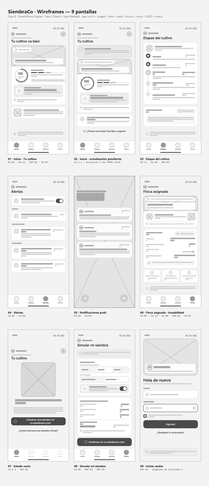

# Wireframes — baja fidelidad

La misma estructura de las 9 pantallas, sin colores, fotos ni textos definitivos: solo cajas, líneas y marcadores de imagen, para validar jerarquía y navegación antes del diseño visual.

| Archivo | Pantalla |
|---|---|
| `01-inicio.png` | Inicio · tu cultivo |
| `02-inicio-pendiente.png` | Inicio · actualización pendiente |
| `03-etapas.png` | Etapas del cultivo |
| `04-alertas.png` | Centro de alertas |
| `05-push.png` | Notificación push |
| `06-finca.png` | Finca asignada y trazabilidad |
| `07-vacio.png` | Sin siembra activa |
| `08-simular.png` | Simular mi siembra |
| `09-login.png` | Iniciar sesión |

