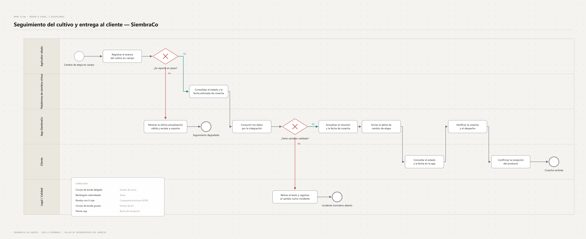

# Entendimiento del negocio

## Proceso to-be: seguimiento del cultivo

Ocho pasos en el camino feliz, dos excepciones y cinco carriles:

| Carril | Por qué está |
|---|---|
| Agricultor aliado | Origen del dato real de campo |
| Plataforma de siembra virtual | Sistema existente con el que la integración es obligatoria (RNF-01) |
| App SiembraCo | El MVP que se diseña |
| Cliente | Usuario final |
| Legal / Calidad | Interviene solo en la excepción normativa |

**Excepciones modeladas:**

1. **El agricultor no reporta en plazo:** la app muestra la última actualización válida y avisa a soporte, en vez de mostrar una etapa sin confirmar.
2. **Texto sanitario sin validar por legal:** se retira y se abre un incidente normativo. Regla: ninguna pantalla muestra una afirmación sanitaria sin respaldo legal.
