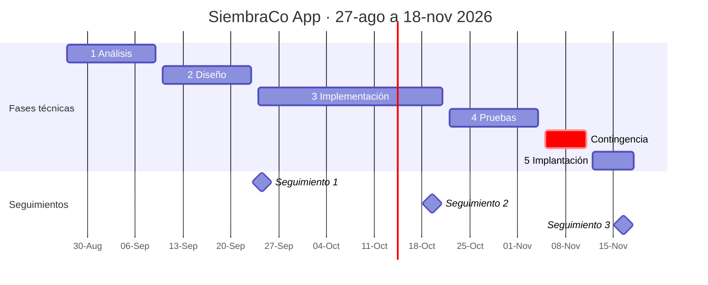

# Cronograma del proyecto

Proyecto del 27 de agosto al 18 de noviembre de 2026, organizado en **iteraciones quincenales**. Cada fase técnica cierra dentro de una iteración, y los seguimientos con el cliente caen al final de una iteración para que siempre haya algo terminado que mostrar.

## Iteraciones

| Iteración | Fechas | Fase | Qué queda cerrado |
|---|---|---|---|
| I1 | 27 ago – 9 sep | 1 · Análisis | Stakeholders, historias de usuario, backlog priorizado, matriz de riesgos, acta de constitución |
| I2 | 10 – 23 sep | 2 · Diseño | Arquitectura, diagramas de actividad, modelo entidad-relación, prototipo de interfaz |
| I3 | 24 sep – 7 oct | 3 · Implementación (sprint 1) | Repositorio estructurado, estándares de codificación, patrones de GUI, primeras pantallas navegables |
| I4 | 8 – 21 oct | 3 · Implementación (sprint 2) | Prototipo navegable completo, pull requests y programación en pares, sprint backlog ejecutado |
| I5 | 22 oct – 4 nov | 4 · Pruebas | Plan y reporte de pruebas de usabilidad |
| I6 | 12 – 18 nov | 5 · Implantación | Despliegue simulado, guía de usuario, informe financiero, presentación final |

## Hitos con el cliente

| Hito | Fecha | Qué se presenta |
|---|---|---|
| Seguimiento 1 | jueves 24 de septiembre | Análisis y diseño |
| Seguimiento 2 | 19 – 24 de octubre | Implementación |
| Seguimiento 3 y presentación final | 16 – 21 de noviembre | Pruebas, implantación y cierre |

Además, revisiones de avance informales cada una o dos semanas.

## Contingencia

La semana del **5 al 11 de noviembre** queda sin entregables asignados. Va **antes** de la última fase y no al final: si algo se atrasa, se absorbe ahí y la implantación llega completa al seguimiento 3, que es el de mayor peso.

El cronograma cubre lo que pide la sección 2.11 del documento del caso: inicio y cierre de cada fase, entregas quincenales, hitos principales y espacios de contingencia.
